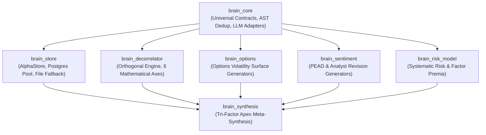

# Architecture

Deep system design and dependency topology for the `brain-alpha-pipeline` library suite.

## Package Topology

The monorepo contains 7 modular packages arranged in a strict Directed Acyclic Graph (DAG):



## Package Directory Tree

```
brain_libraries/
├── scripts/
│   ├── cli.py                 # Unified CLI helper: generate, decorrelate, status
│   └── test_all.py            # Integrated test runner for all 7 packages
├── brain_core/                # Universal contracts & AST deduplication
│   ├── brain_core/
│   │   ├── types.py           # AlphaCandidate, SimSettings, SimMetrics
│   │   ├── config.py          # Env-driven configuration
│   │   ├── logger.py          # Structured logging factory
│   │   ├── llm.py             # Multi-tier LLM fallback adapter
│   │   └── utils/dedup.py     # ASTDeduplicator canonical normalizer
│   └── docs/whitepaper.md     # Contract & AST deduplication formal spec
├── brain_store/               # Dual-mode relational & file storage
│   ├── brain_store/
│   │   ├── store.py           # AlphaStore facade (alias: OptionsStore)
│   │   └── db.py              # PostgreSQL pool with JSON/CSV fallback
│   └── docs/SCHEMA_AND_MIGRATIONS.md
├── brain_decorrelator/        # Orthogonal mutation & correlation gates
│   ├── brain_decorrelator/
│   │   ├── engine.py          # DecorrelationEngine
│   │   ├── plugin.py          # AxisPlugin ABC & @register_axis
│   │   └── axes/universal.py  # 6 core mathematical axes
│   └── docs/AXES.md           # 6-axis mathematical specification
├── brain_options/             # Implied volatility surface alphas (ValueScore: 6.0)
│   ├── brain_options/         # Smirk, VRP, term structure, breakeven
│   └── docs/whitepaper.md     # Options quantitative theory formal spec
├── brain_sentiment/           # Analyst revisions & PEAD alphas (ValueScore: 8.0)
│   ├── brain_sentiment/       # SUE, revision breadth acceleration, dispersion
│   └── docs/whitepaper.md     # Sentiment & PEAD theory formal spec
├── brain_risk_model/          # Factor premia & systematic risk (ValueScore: 7.0)
│   ├── brain_risk_model/      # BAB, idiosyncratic volatility, correlation
│   └── docs/whitepaper.md     # Risk model factor premia formal spec
└── brain_synthesis/           # Tri-Factor Apex meta-synthesis engine
    ├── brain_synthesis/       # ApexGenerator & 5 Golden Apex alphas
    ├── docs/DATA_DICTIONARY.md# WorldQuant BRAIN dataset fields catalog
    └── docs/API.md            # Apex CLI & programmatic API reference
```

## Architectural Invariants

- **Zero Circular Dependencies:** Downstream packages (`brain_synthesis`, `brain_options`) import from `brain_core`, never vice-versa.
- **Contract Standardization:** Every component produces or consumes `brain_core.AlphaCandidate`.
- **Sub-Universe Neutrality:** All synthesized alphas wrap inner factors in `group_neutralize(..., subindustry)`.
- **Deduplication Gate:** Before network evaluation, expressions pass through `ASTDeduplicator` to eliminate algebraic duplicates.
