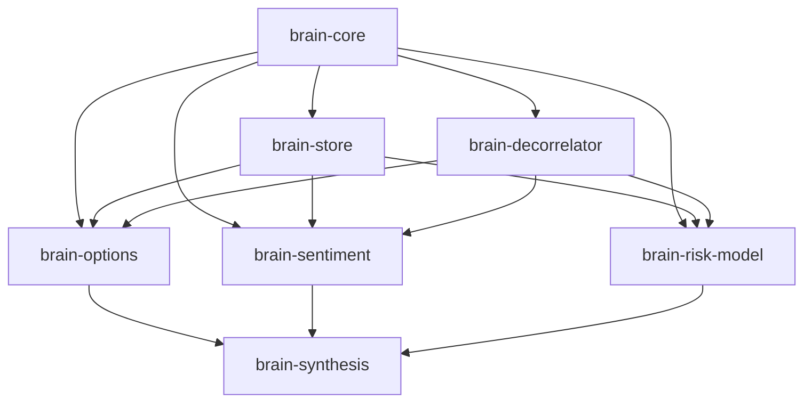

# Brain Alpha Pipeline — Modular Library Suite

A suite of 7 pip-installable Python libraries for WorldQuant BRAIN alpha discovery, orthogonal decorrelation, and tri-factor meta-synthesis.

[](https://github.com/Xtley001/brain-alpha-pipeline/actions)
[](./LICENSE)
[](https://www.python.org/downloads/)
[](https://pypi.org/project/brain-synthesis/)

The `brain_libraries` suite decouples the WorldQuant BRAIN quantitative research workflow into 7 independent, fully tested Python packages. It covers type contracts, dual-mode state storage, strategy-agnostic orthogonal decorrelation, domain engines (Options, Sentiment, Risk Models), and an apex meta-synthesis CLI. For the underlying quantitative methodology, see each library's linked whitepaper.

## Installation

```bash
# Install the entire suite and global 'brain' CLI
pip install brain-synthesis

# Or install individual libraries as needed
pip install brain-decorrelator
pip install brain-options
pip install brain-sentiment
pip install brain-risk-model
```

## Quickstart

```bash
# Generate alpha candidates across all data domains
brain generate --domain all --count 3

# Apply 6-axis orthogonal decorrelation to break correlation (|rho| < 0.70)
brain decorrelate "rank(implied_volatility_call_30)" --base-sharpe 1.55

# Inspect storage health and cache counts
brain store
```

## Package Index

| Library | PyPI Package | Version | Description | Whitepaper |
|---|---|:---:|---|---|
| [`brain_core`](brain_core/) | `brain-core` | `0.1.0` | Shared types, config loader, logging, AST deduplication | [Whitepaper](brain_core/docs/whitepaper.md) |
| [`brain_store`](brain_store/) | `brain-store` | `0.1.0` | PostgreSQL connection pool + flat-file dual-mode persistence | [Schema & Migrations](brain_store/docs/SCHEMA_AND_MIGRATIONS.md) |
| [`brain_decorrelator`](brain_decorrelator/) | `brain-decorrelator` | `0.1.0` | 6-axis orthogonal decorrelation plugin engine | [Axes Guide](brain_decorrelator/docs/AXES.md) |
| [`brain_options`](brain_options/) | `brain-options` | `0.1.0` | Options IV surfaces, term structure, and breakeven engine | [Whitepaper](brain_options/docs/whitepaper.md) |
| [`brain_sentiment`](brain_sentiment/) | `brain-sentiment` | `0.1.0` | PEAD, SUE surprises, and analyst revision diffusion engine | [Whitepaper](brain_sentiment/docs/whitepaper.md) |
| [`brain_risk_model`](brain_risk_model/) | `brain-risk-model` | `0.1.0` | Systematic factor premia & Betting-Against-Beta (BAB) engine | [Whitepaper](brain_risk_model/docs/whitepaper.md) |
| [`brain_synthesis`](brain_synthesis/) | `brain-synthesis` | `0.1.0` | Tri-factor apex cross-synthesis meta-alpha engine & CLI | [Data Dictionary](brain_synthesis/docs/DATA_DICTIONARY.md) |

## Dependency Architecture



## Testing

```bash
# Run test suite across all 7 libraries (86 tests)
python test_all.py
```

## Security

Report vulnerabilities per [SECURITY.md](brain_core/SECURITY.md).

## Contributing

See [CONTRIBUTING.md](brain_core/CONTRIBUTING.md) for contribution guidelines.

## License

Released under the [MIT License](./LICENSE). Maintained by [Xtley001](https://github.com/Xtley001).
