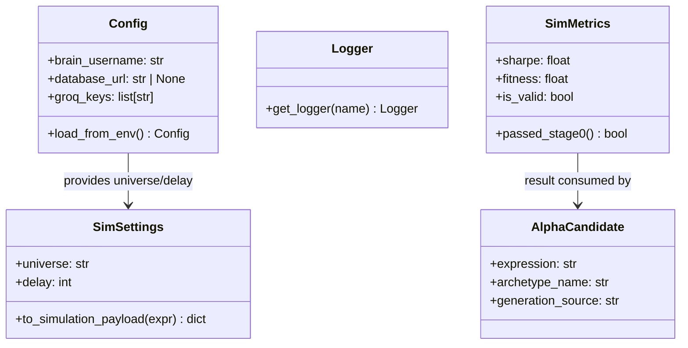

# Architecture — brain-core

```mermaid
classDiagram
    class Config {
        +brain_username: str
        +database_url: str | None
        +groq_keys: list[str]
        +load_from_env() Config
    }
    class Logger {
        +get_logger(name) Logger
    }
    class SimSettings {
        +universe: str
        +delay: int
        +to_simulation_payload(expr) dict
    }
    class SimMetrics {
        +sharpe: float
        +fitness: float
        +is_valid: bool
        +passed_stage0() bool
    }
    class AlphaCandidate {
        +expression: str
        +archetype_name: str
        +generation_source: str
    }
    Config --> SimSettings : provides universe/delay
    SimMetrics --> AlphaCandidate : result consumed by
```

All downstream libraries depend on `brain_core`. Nothing inside `brain_core`
imports from any other Brain library — this is the strict no-circular-dependency rule.
