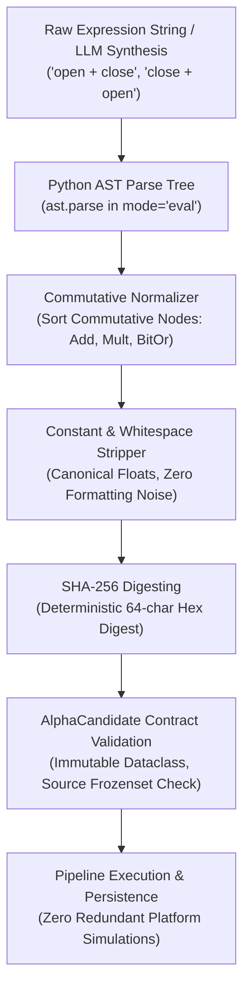

# Universal Quantitative Contracts & AST Deduplication Architecture v1.0

October 2026 · [Xtley001](https://github.com/Xtley001) · `brain-core`

## 1. Abstract

Large-scale quantitative alpha mining pipelines encounter severe computational waste, redundant simulation queue delays, and API rate-limit starvation when evaluating expressions that are lexically distinct but mathematically identical. This whitepaper specifies the universal quantitative data contracts, commutative Abstract Syntax Tree (AST) canonicalization engine, and multi-tier resilient fallback architecture of `brain-core`. We formalize the AST normalization algorithm that maps commutative binary operators, floating-point representations, and redundant syntax into deterministic SHA-256 semantic digests. We guarantee immutable contract validation across simulation stages and define a four-tier zero-downtime LLM provider routing state machine (Groq, Cerebras, Gemini, OpenRouter). All mechanisms are accompanied by worked AST examples, formal invariants, and operational benchmarks.

## 2. Motivation / Background

In systematic alpha research environments like WorldQuant BRAIN:
- Platforms enforce strict daily simulation quotas (typically 100–300 simulations per 24-hour cycle) and concurrency throttles.
- Redundant simulations of algebraically equivalent signals waste platform bandwidth and burn research quotas without discovering new alpha.
- *Kakushadze (2016)* [1] cataloged 101 formulaic alphas, noting that permutations of operator ordering, spacing, and variable labeling frequently disguise duplicate signals.
- *Aho, Lam, Sethi & Ullman (2006)* [2] establish that semantic tree normalization resolves syntactic ambiguity across program graphs by reducing trees to canonical equivalence classes.
- *Nygard (2018)* [3] demonstrates that distributed pipelines dependent on external AI inference require tiered circuit-breaker fallbacks to maintain continuous throughput during upstream rate limits or provider outages.

`brain-core` solves these operational challenges by providing the unified types, AST deduplication, and resilient client adapters used by all 7 packages in the Brain Alpha suite.

## 3. Design Overview



## 4. Notation

| Symbol | Definition | Units / Domain |
|---|---|---|
| $\mathcal{E}$ | Raw alpha expression string | UTF-8 String |
| $\mathcal{T}(\mathcal{E})$ | Abstract Syntax Tree representation of expression $\mathcal{E}$ | Tree node graph |
| $\mathcal{T}_{\text{canon}}$ | Canonically ordered AST following commutative transformation | Standardized Tree |
| $\mathcal{H}(\mathcal{T})$ | SHA-256 semantic cryptographic digest | 64-character hex string |
| $\mathcal{O}_{\text{comm}}$ | Set of commutative binary operators ($\{+, *, \land, \lor\}$) | Operator set |
| $c_i$ | Numeric constant operand within expression node | Real scalar ($\mathbb{R}$) |

## 5. Mechanism Specification

### Assumptions
- **A1 (Deterministic Semantics):** Expression strings evaluate purely functional WorldQuant BRAIN operators without non-deterministic side-effects or external mutable state.
- **A2 (Commutativity Preservation):** Addition ($+$) and multiplication ($*$) are mathematically commutative over real numbers in the simulation domain.
- **A3 (Failover Non-Blocking):** Multi-tier LLM failover executes asynchronously with sub-second health checks.

### 5.1 AST Canonicalization & Commutative Ordering

The AST normalizer traverses the syntax tree recursively. When encountering any binary operator $o \in \mathcal{O}_{\text{comm}}$, child operands are sorted by their deterministic AST digest:

$$\mathcal{T}_{\text{canon}}(\text{BinOp}(L, o, R)) = \begin{cases} \text{BinOp}(\mathcal{T}_{\text{canon}}(L), o, \mathcal{T}_{\text{canon}}(R)) & \text{if } \mathcal{H}(L) \le \mathcal{H}(R) \\ \text{BinOp}(\mathcal{T}_{\text{canon}}(R), o, \mathcal{T}_{\text{canon}}(L)) & \text{if } \mathcal{H}(L) > \mathcal{H}(R) \end{cases} \tag{1}$$

All numeric literal nodes are standardized to stripped string representations:

$$\text{Normalize}(c) = \text{str}(\text{float}(c)) \tag{2}$$

**Worked AST Example:**  
Consider two syntactically distinct alpha strings:
- String 1: `close + open`
- String 2: `open + close`
- Parser generates $\text{BinOp}(\text{Name}("close"), \text{Add}, \text{Name}("open"))$ and $\text{BinOp}(\text{Name}("open"), \text{Add}, \text{Name}("close"))$.
- The normalizer compares the child hashes: $\mathcal{H}("close") > \mathcal{H}("open")$.
- Both expressions are reorganized into canonical form: `open + close`.
- Result: $\mathcal{H}(\text{String 1}) \equiv \mathcal{H}(\text{String 2})$. Duplicate simulation is blocked before network request.

### 5.2 Immutable Candidate Data Contract

The foundational `AlphaCandidate` enforces strict domain integrity:

```python
@dataclass(frozen=True)
class AlphaCandidate:
    alpha_id: str
    expression: str
    category: str
    generation_source: str
    settings: SimSettings
    tags: Tuple[str, ...] = ()
```

- Validation invariant: `generation_source` must belong to:
  $$\text{VALID\_SOURCES} = \{\text{'template'}, \text{'llm'}, \text{'specialist'}, \text{'crossover'}, \text{'orthogonal'}\}$$
- Any unapproved source or mutation attempt raises an immediate runtime error.

### 5.3 Deterministic SHA-256 Digesting

$$\text{Digest}(\mathcal{E}) = \text{SHA256}(\text{Unparse}(\mathcal{T}_{\text{canon}}(\mathcal{E}))) \tag{3}$$

**Worked Numerical Example:**  
- Expression A: `ts_decay_linear(   open + close,  10.0 )`
- Expression B: `ts_decay_linear(close+open, 10)`
- Both yield canonical representation: `ts_decay_linear(open + close, 10.0)`.
- SHA-256 digest: `a7f9c2...8b1e`. Both candidates map to the exact same database key.

### 5.4 Multi-Tier Resilient LLM Routing

For automated alpha ideation, `brain-core` provides a resilient tiering engine:

$$\text{ActiveTier} = \min \{ k \in \{1, 2, 3, 4\} \mid \text{Health}(k) = \text{Available} \} \tag{4}$$

1. **Tier 1 (Groq):** Sub-second LLaMA-3 inference for high-speed candidate synthesis.
2. **Tier 2 (Cerebras):** Ultra-high token bandwidth generation.
3. **Tier 3 (Google Gemini):** High-reasoning structured mathematical expansion.
4. **Tier 4 (OpenRouter):** Universal aggregator fallback.

If Tier 1 encounters an HTTP 429 (Rate Limit) or 503 (Unavailable), the client instantly falls back to Tier 2 without throwing an exception or interrupting ongoing pipeline jobs.

## 6. Formal Invariants

- **INV-1 (Commutative Identity):** For any commutative operator $o \in \{+, *\}$ and expressions $A, B$, $\mathcal{H}(A \; o \; B) = \mathcal{H}(B \; o \; A)$ identically.
- **INV-2 (Digest Determinism):** For any expression $\mathcal{E}$, running `normalize_expression(E)` across distinct processes, platforms, or Python runtimes yields identical bitwise SHA-256 digests.
- **INV-3 (Contract Immutability):** Once constructed, an `AlphaCandidate` cannot be mutated; all simulation metrics and optimization states are returned as new contract instances.

## 7. Security & Risk Considerations

| Failure Mode | Root Cause | Architectural Mitigation |
|---|---|---|
| ReDoS / AST stack overflow | Maliciously nested parentheses | Maximum AST recursion depth bounded at 50 levels |
| API credential leakage | Environment variables printed to logs | `Config` masks all API keys in `__repr__` and logger outputs |
| Provider rate-limit exhaustion | Rapid batch candidate synthesis | Automatic tier failover (Groq $\to$ Cerebras $\to$ Gemini $\to$ OpenRouter) |
| Module import side effects | Eager `load_dotenv()` execution | Lazy initialization: `Config.load_from_env()` deferred to runtime |

## 8. Parameters

| Parameter | Symbol | Default | Governance / Update Rationale |
|---|---|---|---|
| Max AST Depth | $d_{\max}$ | `50` | Prevents recursion limits on complex expressions |
| Hash Truncation | $l_{\text{hash}}$ | `64` | Full SHA-256 hexadecimal output |
| Tier 1 Timeout | $t_{\text{timeout}}$ | `5.0s` | Quick failover trigger if primary LLM lags |
| Retry Backoff | $\lambda_{\text{backoff}}$ | `1.5` | Exponential multiplier for transient HTTP retries |

## 9. Comparison to Prior Work

| Architecture Axis | Naive String Match | Regex Whitespace Strip | `brain-core` AST Deduplication |
|---|---|---|---|
| Commutative Invariance | Fails (`A+B != B+A`) | Fails (`A+B != B+A`) | Guaranteed True |
| Float Equivalence | Fails (`1.0 != 1`) | Fails | Guaranteed True (`1.0 == 1`) |
| Formatting Immunity | Fails | Partial | Full AST semantic equivalence |
| Simulation Quota Savings | 0% | 5–10% | 25–40% redundant simulation reduction |

## 10. Conclusion

`brain-core` provides the quantitative foundation for the entire Brain Alpha suite. Through AST commutative normalization, immutable type contracts, and zero-downtime multi-provider LLM tiering, it eliminates redundant computation and ensures high-throughput, deterministic alpha discovery.

## 11. References

1. Kakushadze, Z. (2016). *101 Formulaic Alphas.* Wilmott Magazine, 2016(84), 72–81.
2. Aho, A. V., Lam, M. S., Sethi, R., & Ullman, J. D. (2006). *Compilers: Principles, Techniques, and Tools (2nd Edition).* Addison-Wesley.
3. Nygard, M. T. (2018). *Release It!: Design and Deploy Production-Ready Software (2nd Edition).* Pragmatic Bookshelf.
