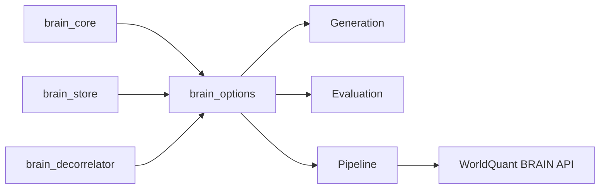

# Architecture — brain-options

```mermaid
flowchart LR
    Core[brain_core] --> Options
    Store[brain_store] --> Options
    Decor[brain_decorrelator] --> Options
    Options[brain_options] --> Generation
    Options --> Evaluation
    Options --> Pipeline
    Pipeline --> BRAIN[WorldQuant BRAIN API]
```

The `OptionsAlphaEngine` in `pipeline/engine.py` is the only public entry point.
External callers should not import from `generation/` or `evaluation/` directly.
