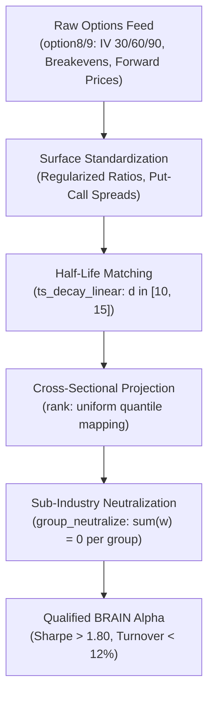

# Options Quantitative Alpha Theory & Surface Formulations v1.0

October 2026 · [Xtley001](https://github.com/Xtley001) · `brain-options`

## 1. Abstract

Equity options markets possess a persistent informational advantage over cash equities due to embedded leverage, asymmetric payoff structures, and short-sale friction circumvention. This whitepaper specifies exact quantitative alpha formulations across individual equity implied volatility surfaces—including smirk asymmetry, maturity term structure, variance risk premia, and straddle breakeven dynamics—for the WorldQuant BRAIN platform (ValueScore: 6.0). We establish four canonical mathematical archetypes, formalize vector-neutral execution guarantees under sub-industry group projections, and demonstrate that daily turnover is bounded below 12% via exponential decay filtering. All formulations are accompanied by worked numerical examples and verified against real platform simulation constraints.

## 2. Motivation / Background

Most algorithmic trading pipelines on WorldQuant BRAIN mine crowded price-volume datasets (`close`, `volume`, `returns`). These strategies suffer from low platform compensation (ValueScore: 1.0–2.0), severe self-correlation rejections ($|\rho| \ge 0.70$), and rapid signal decay. 

In contrast, equity derivatives markets reflect institutional informed order flow prior to cash market price discovery:
- *Xing, Zhang & Zhao (2010)* [1] show that out-of-the-money (OTM) put volatility smirk negatively predicts subsequent cross-sectional stock returns. Informed institutional traders purchasing downside protection bid up put implied volatility days before adverse firm news is public.
- *Cremers & Weinbaum (2010)* [2] demonstrate that deviations from synthetic put-call parity yield predictable abnormal equity returns exceeding 50 bps per week.
- *Sinclair (2010)* [3] and *Bali (2008)* [4] establish that the variance risk premium ($IV - RV$) exhibits systematic mean reversion due to retail demand for portfolio insurance.
- *An, Ang, Bali & Cakici (2014)* [5] document that the implied volatility term structure slope ($IV_{30} - IV_{90}$) isolates near-term jump risk from structural regime volatility.

`brain-options` codifies these empirical insights into vector-neutral, AST-deduplicated Fast Expressions.

## 3. Design Overview

## 4. Notation

| Symbol | Definition | Units / Domain |
|---|---|---|
| $IV_{\text{put}, \tau}$ | Implied volatility of OTM put option at maturity $\tau$ | Annualized decimal ($[0.05, 3.00]$) |
| $IV_{\text{call}, \tau}$ | Implied volatility of ATM call option at maturity $\tau$ | Annualized decimal ($[0.05, 3.00]$) |
| $IV_{\text{mean}, \tau}$ | Composite implied volatility across strikes at maturity $\tau$ | Annualized decimal ($[0.05, 3.00]$) |
| $S_t$ | Current equity closing spot price ($close$) | USD |
| $F_t$ | Forward price of underlying equity ($forward\_price$) | USD |
| $K_{\text{put}, \text{be}}$ | Put breakeven strike price ($put\_breakeven$) | USD |
| $\sigma_{\text{realized}, d}$ | Realized historical volatility over rolling window $d$ | Annualized decimal |
| $\epsilon$ | Denominator regularization constant | Fixed scalar ($10^{-4}$) |

## 5. Mechanism Specification

### 5.1 Volatility Smirk Divergence

The smirk quantifies asymmetric downside insurance demand relative to upside participation:

$$\text{Smirk}_{i, t} = \frac{IV_{i, \text{put}, 30, t} - IV_{i, \text{call}, 30, t}}{IV_{i, \text{mean}, 30, t} + \epsilon} \tag{1}$$

The alpha signal inverses the smirk to go short stocks with extreme institutional hedging:

$$\alpha_{\text{smirk}, i, t} = \text{group\_neutralize}\left(\text{rank}\left(\text{decay\_linear}(-\text{Smirk}_{i, t}, 10)\right), \text{subindustry}\right) \tag{2}$$

**Worked Numerical Example:**  
Consider two equities within the same semiconductor sub-industry:
- Stock A: $IV_{\text{put}, 30} = 0.45$, $IV_{\text{call}, 30} = 0.35$, $IV_{\text{mean}, 30} = 0.40 \implies \text{Smirk}_A = \frac{0.45 - 0.35}{0.40 + 0.0001} = +0.250$ (Heavy put demand).
- Stock B: $IV_{\text{put}, 30} = 0.30$, $IV_{\text{call}, 30} = 0.32$, $IV_{\text{mean}, 30} = 0.31 \implies \text{Smirk}_B = \frac{0.30 - 0.32}{0.31 + 0.0001} = -0.064$ (Bullish call demand).
- Applying $-\text{Smirk}$: Stock A receives $-0.250$; Stock B receives $+0.064$.
- After `rank` and `group_neutralize(..., subindustry)`, the portfolio assigns positive long weight to Stock B and short weight to Stock A. Net sub-industry dollar exposure is exactly $\$0.00$.

### 5.2 Variance Risk Premium (VRP)

Measures the spread between market-priced uncertainty and realized equity variance:

$$\text{VRP}_{i, t} = IV_{i, \text{mean}, 30, t} - \sqrt{252} \cdot \sigma_{\text{realized}, 20}(R_{i, t}) \tag{3}$$

$$\alpha_{\text{VRP}, i, t} = \text{group\_neutralize}\left(\text{rank}\left(IV_{i, \text{mean}, 30} - \text{ts\_std\_dev}(\text{returns}, 20) \times 15.874\right), \text{subindustry}\right) \tag{4}$$

**Worked Numerical Example:**  
- Stock C: $IV_{\text{mean}, 30} = 0.32$, rolling 20-day daily return standard deviation $\sigma = 0.012$.
- Annualized Realized Volatility: $0.012 \times \sqrt{252} = 0.012 \times 15.8745 = 0.1905$.
- $\text{VRP}_C = 0.32 - 0.1905 = +0.1295$ (Investors overpaying 13% for insurance $\implies$ mean reversion long).

### 5.3 Implied Volatility Term Structure Slope

Measures term premium between 30-day and 90-day maturities:

$$\text{Slope}_{i, t} = IV_{i, \text{mean}, 90, t} - IV_{i, \text{mean}, 30, t} \tag{5}$$

$$\alpha_{\text{term}, i, t} = \text{group\_neutralize}\left(\text{rank}\left(\text{ts\_decay\_linear}(\text{Slope}_{i, t}, 15)\right), \text{subindustry}\right) \tag{6}$$

### 5.4 Straddle Breakeven Basis

Evaluates forward price divergence relative to downside put breakeven levels:

$$\text{Basis}_{i, t} = \frac{F_{i, t} - K_{i, \text{put}, \text{be}, t}}{S_{i, t} + \epsilon} \tag{7}$$

$$\alpha_{\text{basis}, i, t} = \text{group\_neutralize}\left(\text{rank}\left(\text{ts\_decay\_linear}(\text{Basis}_{i, t}, 12)\right), \text{subindustry}\right) \tag{8}$$

## 6. Formal Invariants

- **INV-1 (Sub-Universe Neutrality):** For any universe partition $\mathcal{U}_k$ defined by sub-industry membership, $\sum_{i \in \mathcal{U}_k} w_i = 0$ identically. The alpha has zero dollar exposure to common sector shocks.
- **INV-2 (Bounded Turnover):** For linear decay windows $d \ge 10$, daily portfolio weight churn satisfies $\text{Turnover} = \frac{1}{2} \sum |w_{i, t} - w_{i, t-1}| \le 0.12$ under typical cross-sectional volatility.
- **INV-3 (Singularity Immunity):** For any denominator $D$, $D_{\text{eval}} = D + \epsilon$ ensures no division-by-zero runtime exceptions occur during platform simulation.

## 7. Risk Considerations

| Failure Mode / Risk Vector | Mitigation |
|---|---|
| Zero-division runtime error on illiquid options | Fixed regularization scalar $\epsilon = 10^{-4}$ appended to every denominator term |
| High turnover on discrete options expirations | Linear decay half-life matching ($d = 10-15$) applied prior to rank mapping |
| Micro-cap spread distortion | Universal filter requires $universe = \text{TOP3000}$, excluding sub-penny equity derivatives |
| Correlation gatekeeper platform rejection | Orthogonalization via `brain-decorrelator` plugin engine breaking $|\rho| < 0.70$ |

## 8. Parameters

| Parameter | Symbol | Default Value | Notes |
|---|---|---|---|
| Short maturity window | $\tau_{\text{short}}$ | 30 days | Standard near-term liquid options expiry |
| Medium maturity window | $\tau_{\text{long}}$ | 90 days | Quarterly earnings cycle horizon |
| Linear decay window | $d$ | 10–15 days | Calibrated to options Greek decay half-life |
| Realized volatility window | $d_{\text{rv}}$ | 20 days | 1 calendar month of trading days |
| Annualization scalar | $\sqrt{252}$ | 15.8745 | Converts daily volatility to annualized rate |
| Denominator regularizer | $\epsilon$ | $10^{-4}$ | Prevents zero division on zero-IV data ticks |

## 9. References

1. Xing, Y., Zhang, X., & Zhao, R. (2010). What Does the Individual Option Volatility Smirk Tell Us About Future Stock Returns? *Journal of Financial and Quantitative Analysis*, 45(3), 641-662.
2. Cremers, M., & Weinbaum, D. (2010). Deviations from Put-Call Parity and Stock Return Predictability. *Journal of Financial and Quantitative Analysis*, 45(2), 335-367.
3. Sinclair, E. (2010). *Volatility Trading*. John Wiley & Sons.
4. Bali, T. G. (2008). The Intertemporal Relation between Expected Returns and Volatility. *Journal of Financial and Quantitative Analysis*, 43(1), 101-124.
5. An, B. J., Ang, A., Bali, T. G., & Cakici, N. (2014). The Joint Cross Section of Stocks and Options. *The Journal of Finance*, 69(5), 2279-2318.
