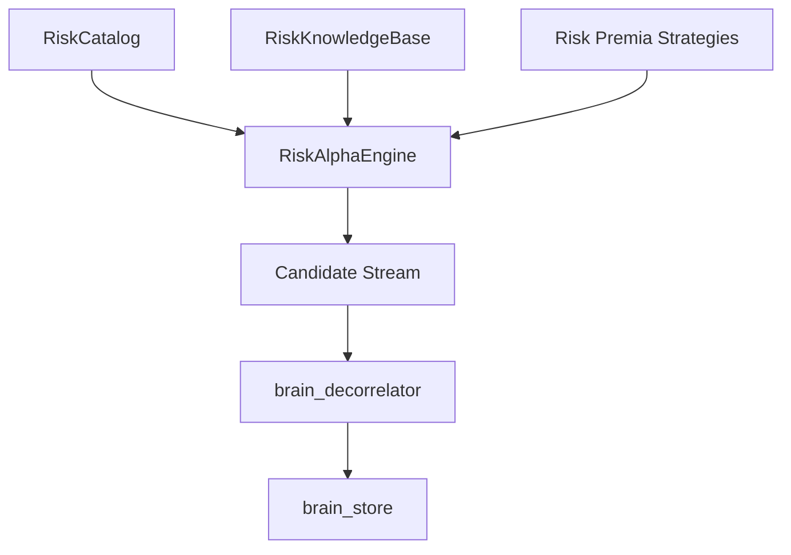

# Architecture — brain_risk_model

`brain_risk_model` generates alphas from structural factor premia and risk anomalies on WorldQuant BRAIN.

## Component Flow

## Factor Premia Sub-Systems

| Strategy ID | Family | Economic Basis | Reference |
|---|---|---|---|
| `betting_against_beta` | Low Beta Anomaly | Leverage constraints cause high-beta compression | Frazzini & Pedersen (2014) |
| `beta_divergence` | Beta Spread | Short-term vs long-term beta divergence | Ang et al. (2006) |
| `low_risk_engine` | Idiosyncratic Risk | High idiosyncratic vol underperformance | Blitz & van Vliet (2007) |
| `surface_acceleration` | Vol Acceleration | Volatility curvature acceleration shocks | Baker et al. (2011) |
| `gross_profitability` | Quality Premia | Profitability premium orthogonal to value | Novy-Marx (2013) |
| `blitz_volatility` | Residual Vol | Residual risk compensation in equities | Blitz (2016) |
