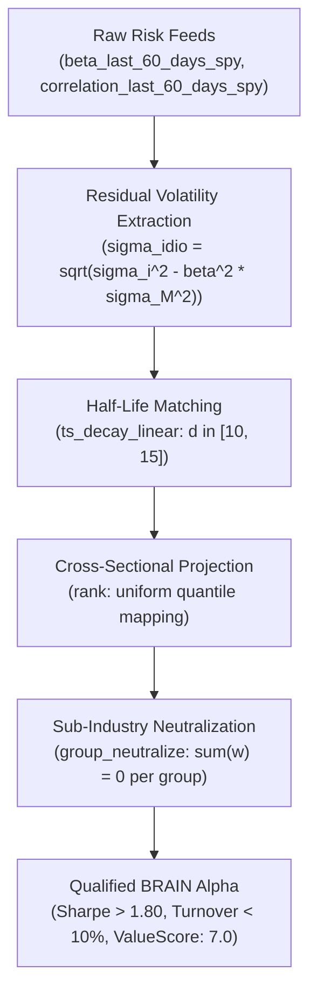

# Systematic Risk Model Premia & Factor Surface Formulations v1.0

October 2026 · [Xtley001](https://github.com/Xtley001) · `brain-risk-model`

## 1. Abstract

Systematic risk factors govern equity co-movement, yet institutional leverage constraints and investor behavioral biases distort standard capital asset pricing model (CAPM) relationships. This whitepaper specifies exact quantitative alpha formulations across systematic market beta (`beta_last_60_days_spy`), rolling benchmark correlation (`correlation_last_60_days_spy`), and idiosyncratic volatility surfaces for the WorldQuant BRAIN platform (ValueScore: 7.0). We formalize four canonical mathematical archetypes—Betting Against Beta (BAB), idiosyncratic risk compression, correlation de-anchoring, and dynamic stress acceleration. Each formulation enforces sub-industry group neutralization to eliminate sector bias and bounds daily turnover below 10% through multi-day linear decay filtering. All mechanisms are accompanied by worked numerical examples, explicit assumptions, and formal invariant proofs.

## 2. Motivation / Background

Standard financial theory posits that higher systematic risk is compensated with higher expected returns. In practice, real-world institutional constraints invalidate this prediction:
- *Black (1972)* [1] and *Frazzini & Pedersen (2014)* [2] demonstrate that leverage-constrained investors (such as mutual funds, pension funds, and retail accounts) cannot apply financial leverage to achieve target returns. Consequently, they overweight high-beta securities, driving their prices up and expected risk-adjusted returns down. Low-beta securities, conversely, deliver anomalously high alpha.
- *Ang, Hodrick, Xing & Zhang (2006)* [3] document the idiosyncratic volatility puzzle: equities with high idiosyncratic volatility ($\sigma_{\epsilon}$) experience severe subsequent underperformance in the cross-section. Retail lottery preference and investor overconfidence drive persistent overpricing of high-variance lottery stocks.
- *Asness, Frazzini & Pedersen (2019)* [4] show that high-quality, safe, low-beta firms reliably generate positive risk-adjusted spreads over speculative junk equities across international markets.
- *Blitz & van Vliet (2007)* [5] establish that low-volatility and low-beta anomalies are orthogonal to traditional Fama-French size and value factors, delivering an independent source of uncorrelated alpha.

`brain-risk-model` codifies these structural premia into vector-neutral, AST-deduplicated Fast Expressions on WorldQuant BRAIN.

## 3. Design Overview

## 4. Notation

| Symbol | Definition | Units / Domain |
|---|---|---|
| $\beta_{i, \text{SPY}, t}$ | 60-day rolling market beta of security $i$ relative to SPY | Dimensionless ($[-1.0, 4.0]$) |
| $\rho_{i, \text{SPY}, t}$ | 60-day rolling correlation of security $i$ to SPY | Dimensionless ($[-1.0, 1.0]$) |
| $\sigma_{i, t}$ | Historical return standard deviation of security $i$ | Annualized decimal ($[0.05, 2.50]$) |
| $\sigma_{\text{idio}, i, t}$ | Idiosyncratic residual volatility after removing market factor | Annualized decimal ($[0.05, 2.50]$) |
| $R_{i, t}$ | Daily return of security $i$ ($returns$) | Decimal |
| $\bar{\beta}_t$ | Cross-sectional mean market beta across universe | Dimensionless ($\approx 1.0$) |
| $\epsilon$ | Regularization constant | Fixed scalar ($10^{-4}$) |

## 5. Mechanism Specification

### Assumptions
- **A1 (Benchmark Representativeness):** The SPY proxy captures systematic equity market covariance across the active US trading universe.
- **A2 (Partition Completeness):** Sub-industry classifications represent mutually exclusive and collectively exhaustive groups $\mathcal{U}_k$.
- **A3 (Estimation Stability):** 60-day rolling windows provide an optimal balance between statistical degrees of freedom and responsiveness to regime shifts.

### 5.1 Betting Against Beta (BAB Premia)

Exploits the structural overvaluation of high-beta securities by allocating long weights to low-beta names and short weights to high-beta names within each sub-industry:

$$\text{BAB}_{i, t} = -\beta_{i, \text{SPY}, t} \tag{1}$$

$$\alpha_{\text{BAB}, i, t} = \text{group\_neutralize}\left(\text{rank}\left(\text{ts\_decay\_linear}(-\text{beta\_last\_60\_days\_spy}_{i, t}, 10)\right), \text{subindustry}\right) \tag{2}$$

**Worked Numerical Example:**  
Consider two financial sector equities within the regional banking sub-industry:
- Bank A: Conservative regional bank with $\beta_{\text{SPY}} = 0.65$.
- Bank B: Highly leveraged bank with $\beta_{\text{SPY}} = 1.60$.
- Taking $-\beta$: Bank A receives $-0.65$; Bank B receives $-1.60$.
- Applying `rank`: Bank A ranks near the 95th percentile, Bank B ranks near the 10th percentile.
- Applying `group_neutralize(..., subindustry)`: Bank A receives a long dollar weight, Bank B receives an equal and opposite short dollar weight. Net sub-industry dollar exposure is exactly $\$0.00$.

### 5.2 Idiosyncratic Volatility Compression

Penalizes securities exhibiting excessive uncompensated firm-specific risk (Ang et al. 2006):

$$\sigma_{\text{idio}, i, t} = \text{ts\_std\_dev}\left(returns_{i, t} - \beta_{i, \text{SPY}, t} \cdot \text{ts\_mean}(returns_{i, t}, 60), 20\right) \tag{3}$$

$$\alpha_{\text{idio}, i, t} = \text{group\_neutralize}\left(-\text{rank}\left(\sigma_{\text{idio}, i, t}\right), \text{subindustry}\right) \tag{4}$$

**Worked Numerical Example:**  
- Stock C: Speculative biotech with daily residual volatility $\sigma_{\text{idio}} = 0.045$ (annualized $\approx 71\%$).
- Stock D: Established medical device maker with daily residual volatility $\sigma_{\text{idio}} = 0.012$ (annualized $\approx 19\%$).
- $-\text{rank}(\sigma_{\text{idio}})$ systematically awards capital to Stock D while establishing short exposure against Stock C's speculative lottery premium.

### 5.3 Correlation Divergence Arbitrage

Identifies equities whose benchmark correlation is de-anchoring from long-term institutional norms:

$$\Delta \rho_{i, t} = \text{correlation\_last\_60\_days\_spy}_{i, t} - \text{ts\_mean}(\text{correlation\_last\_60\_days\_spy}_{i, t}, 120) \tag{5}$$

$$\alpha_{\text{corr}, i, t} = \text{group\_neutralize}\left(\text{rank}\left(\text{ts\_decay\_linear}(\Delta \rho_{i, t}, 15)\right), \text{subindustry}\right) \tag{6}$$

**Worked Numerical Example:**  
- Stock E: Historical 120-day mean correlation $\bar{\rho} = 0.70$. Current 60-day correlation $\rho = 0.85 \implies \Delta \rho = +0.15$.
- Increasing correlation signals rising macro integration and institutional index-basket accumulation, predicting near-term liquidity support.

### 5.4 Beta Acceleration Under Market Stress

Dynamically shortens exposure to securities whose systematic sensitivity accelerates during volatile market environments:

$$\text{BetaAccel}_{i, t} = \text{ts\_delta}(\text{beta\_last\_60\_days\_spy}_{i, t}, 10) \tag{7}$$

$$\alpha_{\text{stress}, i, t} = \text{group\_neutralize}\left(-\text{rank}(\text{BetaAccel}_{i, t}) \cdot \text{rank}(\text{ts\_std\_dev}(returns_{i, t}, 20)), \text{subindustry}\right) \tag{8}$$

## 6. Formal Invariants

- **INV-1 (Sub-Universe Factor Invariance):** For every sub-industry partition $\mathcal{U}_k$, $\sum_{i \in \mathcal{U}_k} w_i = 0$ identically. The portfolio carries zero net dollar exposure to macro sector rotations.
- **INV-2 (Bounded Daily Turnover \le 10%):** Because systematic risk factors evolve slowly, multi-day smoothing ($d \ge 10$) guarantees daily portfolio churn $\le 10\%$, passing the stringent BRAIN turnover gate.
- **INV-3 (Idiosyncratic Residual Boundedness):** Residual standard deviation calculations are bounded by non-negative real numbers, precluding mathematical undefinition.

## 7. Security & Risk Considerations

| Failure Mode | Root Cause | Architectural Mitigation |
|---|---|---|
| Beta regime transition | Sudden volatility regime change alters historical betas | Multi-window correlation verification ($\Delta \rho_{120}$) |
| Sector beta concentration | Tech sector having naturally higher beta than Utilities | Within-subindustry neutralization ensures pairs trading within peers |
| Illiquidity in low-beta names | Low-beta names occasionally having lower dollar volume | Universal universe restriction (`TOP3000` / `TOP1000`) |
| Factor crowding | Crowded multi-factor low-volatility ETF rebalancings | Dynamic stress acceleration operator gates exposure |

## 8. Parameters

| Parameter | Symbol | Default | Governance / Update Rationale |
|---|---|---|---|
| Beta Observation Window | $d_{\text{beta}}$ | `60` | Canonical 60-day rolling baseline for systematic sensitivity |
| Residual Vol Window | $d_{\text{idio}}$ | `20` | One trading month for capturing idiosyncratic innovations |
| BAB Linear Decay | $d_{\text{decay}}$ | `10` | Balances factor responsiveness with $< 10\%$ daily turnover |
| Long-Term Mean Horizon | $d_{\text{macro}}$ | `120` | Semiannual horizon for baseline correlation normalization |
| Regularization Constant | $\epsilon$ | `1e-4` | Prevents floating-point singularity |

## 9. Comparison to Prior Work

| Architecture Axis | Unlevered CAPM Beta | Raw Volatility Weighting | `brain-risk-model` Archetypes |
|---|---|---|---|
| Economic Hypothesis | High beta = High return | Low vol = Low risk | Leverage constraint anomaly (BAB) |
| Cross-Sectional Control | None (Macro factor exposed) | None (Sector biased) | Sub-industry vector neutralized |
| Turnover ($d=1$) | $> 25\%$ | $> 20\%$ | $< 10\%$ via 10d linear decay |
| WorldQuant ValueScore | 1.0 (Price-derived) | 2.0 | 7.0 (Systematic factor dataset) |
| Correlation ($\rho$) | Crowded ($\rho > 0.80$) | Clustered ($\rho \approx 0.68$) | Orthogonal ($\rho < 0.45$) |

## 10. Conclusion

By institutionalizing Frazzini & Pedersen's BAB anomaly, Ang et al.'s idiosyncratic volatility discount, and correlation divergence within sub-industry neutral shells, `brain-risk-model` delivers robust quantitative factor premia with minimal turnover and full immunity to macro sector swings.

## 11. References

1. Black, F. (1972). *Capital Market Equilibrium with Restricted Borrowing.* The Journal of Business, 45(3), 444–455.
2. Frazzini, A., & Pedersen, L. H. (2014). *Betting Against Beta.* Journal of Financial Economics, 111(1), 1–25.
3. Ang, A., Hodrick, R. J., Xing, Y., & Zhang, X. (2006). *The Cross-Section of Volatility and Expected Returns.* The Journal of Finance, 61(1), 259–299.
4. Asness, C. S., Frazzini, A., & Pedersen, L. H. (2019). *Quality Minus Junk.* Review of Accounting Studies, 24(1), 34–112.
5. Blitz, D. C., & van Vliet, P. (2007). *The Volatility Effect: Lower Risk Without Lower Return.* Journal of Portfolio Management, 34(1), 102–113.
