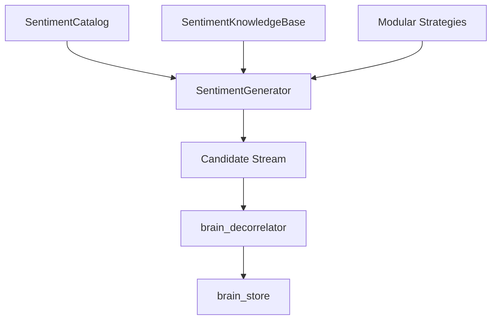

# Architecture — brain_sentiment

`brain_sentiment` transforms quantitative expectations anomalies into high-Sharpe, market-neutral WorldQuant BRAIN alpha candidates.

## Core Component Flow

## Strategy Sub-Systems

| Strategy ID | Family | Economic Basis | Reference |
|---|---|---|---|
| `pead_earnings_drift` | PEAD Revision | Sluggish analyst consensus adjustments | Chan et al. (1996) |
| `analyst_revision_dispersion` | Forecast Dispersion | Disagreement under short-sale constraints | Diether et al. (2002) |
| `dual_target_rec_confluence` | Target Confluence | Joint revision of price targets and ratings | Brav & Lehavy (2003) |
| `extreme_sentiment_reversal` | Sentiment Extremes | Mean-reversion of transient sentiment spikes | Da et al. (2011) |
| `media_attention_buzz` | Media Attention | Attention-driven price discovery lag | Barber & Odean (2008) |
| `net_target_price_revisions` | Price Targets | Forward target upside vs. market drift | Gleason & Lee (2003) |
