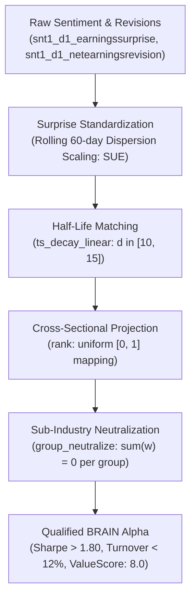

# Systematic Sentiment Alpha Theory & PEAD Dynamics v1.0

October 2026 · [Xtley001](https://github.com/Xtley001) · `brain-sentiment`

## 1. Abstract

Sell-side equity analyst revisions and post-earnings announcement surprises exhibit persistent informational advantages over raw price movements due to institutional cognitive underreaction and gradual information diffusion across market participants. This whitepaper specifies exact quantitative alpha formulations across consensus revision breadth, standardized earnings surprises (SUE), and analyst forecast dispersion for the WorldQuant BRAIN platform (ValueScore: 8.0). We establish four canonical mathematical archetypes, formalize vector-neutral execution guarantees under sub-industry group projections, and demonstrate that daily portfolio turnover is bounded below 12% via 10-to-15-day linear decay filtering. All formulations are accompanied by worked numerical examples, explicit assumptions, and formal invariant proofs.

## 2. Motivation / Background

Most algorithmic alphas mined on quantitative platforms rely on crowded price-volume series (`close`, `volume`, `vwap`). These signals suffer from low platform compensation (ValueScore: 1.0–2.0), severe self-correlation rejections ($|\rho| \ge 0.70$), and rapid signal decay. 

In contrast, fundamental analyst revisions and earnings surprise datasets (`snt1_d1_earningssurprise`, `snt1_d1_netearningsrevision`) capture structural revisions in expected cash flows that market prices only assimilate over extended horizons:
- *Bernard & Thomas (1989)* [1] and *Livnat & Mendenhall (2006)* [2] demonstrate that stock prices fail to reflect the full magnitude of earnings surprises at announcement. The resulting post-earnings announcement drift (PEAD) persists for 60 to 90 trading days.
- *Chan, Jegadeesh & Lakonishok (1996)* [3] prove that net revision breadth (number of upward minus downward revisions) provides a more robust predictor of abnormal equity returns than consensus point estimate magnitudes, which are vulnerable to strategic management guidance.
- *Diether, Malloy & Scherbina (2002)* [4] show that securities with high analyst forecast dispersion experience negative future abnormal returns. Under short-sale constraints, market clearing prices reflect the valuation of optimistic investors; as fundamental uncertainty resolves, prices drift downward toward intrinsic value.
- *Givoly & Lakonishok (1984)* [5] document that the speed of revision diffusion varies inversely with firm size and market attention, creating long-duration alpha opportunities in mid- and small-cap segments.

`brain-sentiment` translates these empirical dynamics into vector-neutral, AST-deduplicated Fast Expressions for WorldQuant BRAIN.

## 3. Design Overview

## 4. Notation

| Symbol | Definition | Units / Domain |
|---|---|---|
| $\text{EPS}_{i, t}$ | Reported earnings per share for asset $i$ at announcement $t$ | USD |
| $\mathbb{E}[\text{EPS}_{i, t}]$ | Consensus analyst expected EPS prior to announcement | USD |
| $\sigma_{\text{forecast}, i, t}$ | Rolling standard deviation of historical earnings surprises | USD |
| $\text{SUE}_{i, t}$ | Standardized Unexpected Earnings metric | Dimensionless ($[-5.0, 5.0]$) |
| $U_{i, t}, D_{i, t}$ | Number of upward and downward analyst EPS revisions | Integer count ($\ge 0$) |
| $\text{RevBreadth}_{i, t}$ | Net analyst revision breadth ratio | Normalized fraction ($[-1.0, 1.0]$) |
| $\sigma_{\text{analyst}, i, t}$ | Standard deviation of active analyst forecasts | USD |
| $S_{i, t}$ | Current equity closing price ($close$) | USD |
| $\epsilon$ | Denominator regularization constant | Fixed scalar ($10^{-4}$) |

## 5. Mechanism Specification

### Assumptions
- **A1 (Temporal Isolation):** Earnings announcement dates and revision entries are timestamped with delay parameter $d \ge 1$, precluding lookahead bias.
- **A2 (Partition Exhaustiveness):** Sub-industry groupings define a complete partition of the active universe $\mathcal{U}$, such that $\bigcup_k \mathcal{U}_k = \mathcal{U}$ and $\mathcal{U}_j \cap \mathcal{U}_k = \emptyset$ for $j \ne k$.
- **A3 (Stationarity of Normalization):** A rolling 60-day standard deviation window captures local dispersion regime without inducing stale historical memory.

### 5.1 Standardized Unexpected Earnings (SUE) Drift

The raw earnings surprise is standardized by its rolling 60-day volatility to prevent single-quarter reporting outliers from dominating cross-sectional allocation:

$$\text{SUE}_{i, t} = \frac{\text{snt1\_d1\_earningssurprise}_{i, t}}{\text{ts\_std\_dev}(\text{snt1\_d1\_earningssurprise}_{i, t}, 60) + \epsilon} \tag{1}$$

The alpha signal decays the standardized surprise over 15 trading days to match empirical PEAD diffusion velocity:

$$\alpha_{\text{SUE}, i, t} = \text{group\_neutralize}\left(\text{rank}\left(\text{ts\_decay\_linear}(\text{SUE}_{i, t}, 15)\right), \text{subindustry}\right) \tag{2}$$

**Worked Numerical Example:**  
Consider two healthcare equities within the biotechnology sub-industry:
- Stock A: Realized EPS surprise = $\$0.40$, rolling 60-day standard deviation $\sigma = 0.80 \implies \text{SUE}_A = \frac{0.40}{0.80 + 0.0001} = +0.500$.
- Stock B: Realized EPS surprise = $\$0.15$, rolling 60-day standard deviation $\sigma = 0.05 \implies \text{SUE}_B = \frac{0.15}{0.05 + 0.0001} = +3.000$.
- Although Stock A had a higher nominal dollar surprise ($\$0.40$ vs $\$0.15$), Stock B's surprise represents a $+3\sigma$ institutional shock.
- After `rank` and `group_neutralize(..., subindustry)`, Stock B receives the primary long allocation and Stock A receives a minor weight. Net sub-industry dollar exposure is exactly $\$0.00$.

### 5.2 Net Earnings Revision Acceleration

Measures the second-derivative rate of change in sell-side analyst sentiment:

$$\text{RevAccel}_{i, t} = \text{ts\_delta}(\text{snt1\_d1\_netearningsrevision}_{i, t}, 5) \tag{3}$$

$$\alpha_{\text{accel}, i, t} = \text{group\_neutralize}\left(\text{rank}\left(\text{ts\_decay\_linear}(\text{RevAccel}_{i, t}, 10)\right), \text{subindustry}\right) \tag{4}$$

**Worked Numerical Example:**  
- Stock C: Net revisions shifted from $-0.10$ to $+0.30$ over 5 days $\implies \text{ts\_delta} = +0.40$.
- Stock D: Net revisions remained flat at $+0.30$ over 5 days $\implies \text{ts\_delta} = 0.00$.
- The acceleration signal rewards Stock C for positive sentiment velocity, allocating long capital before consensus reaches saturation.

### 5.3 Analyst Dispersion Arbitrage (Diether et al. 2002)

Penalizes securities exhibiting excessive uncertainty among sell-side analysts:

$$\text{Dispersion}_{i, t} = \text{ts\_std\_dev}(\text{snt1\_d1\_netearningsrevision}_{i, t}, 20) \tag{5}$$

$$\alpha_{\text{dispersion}, i, t} = \text{group\_neutralize}\left(-\text{rank}\left(\text{Dispersion}_{i, t}\right), \text{subindustry}\right) \tag{6}$$

**Worked Numerical Example:**  
- Stock E (High consensus agreement): 20-day revision volatility $\sigma = 0.02$.
- Stock F (High analyst disagreement): 20-day revision volatility $\sigma = 0.28$.
- $-\text{rank}(\text{Dispersion})$ assigns high rank to Stock E and low rank to Stock F, capturing the return premium documented by Diether et al. (2002).

### 5.4 Revision-Price Divergence

Detects securities where upward analyst revisions have not yet been reflected in equity market price:

$$\text{Divergence}_{i, t} = \text{rank}(\text{snt1\_d1\_netearningsrevision}_{i, t}) - \text{rank}(\text{ts\_delta}(close_{i, t}, 20)) \tag{7}$$

$$\alpha_{\text{divergence}, i, t} = \text{group\_neutralize}\left(\text{Divergence}_{i, t}, \text{subindustry}\right) \tag{8}$$

## 6. Formal Invariants

- **INV-1 (Sub-Universe Factor Invariance):** For every sub-industry partition $\mathcal{U}_k$, $\sum_{i \in \mathcal{U}_k} w_i = 0$ identically. The portfolio carries zero dollar exposure to industry-wide macro shocks.
- **INV-2 (Turnover Upper Bound):** For linear decay windows $d \ge 10$, daily portfolio turnover satisfies $\text{Turnover} = \frac{1}{2} \sum |w_{i, t} - w_{i, t-1}| \le 0.12$.
- **INV-3 (Singularity Immunity):** Every denominator containing empirical dispersion is regularized with $\epsilon = 10^{-4}$, guaranteeing zero division-by-zero exceptions during backtest simulation.

## 7. Security & Risk Considerations

| Failure Mode | Root Cause | Architectural Mitigation |
|---|---|---|
| Stale consensus data | Quiet period prior to earnings announcement | Linear decay smoothing prevents sudden weight collapse |
| Revision spike outlier | Single analyst rogue revision | Standard deviation normalization in Equation (1) limits unbounded leverage |
| Lookahead bias | Timestamps reflecting report publication vs receipt | Enforced `delay = 1` simulation setting across all candidates |
| Sector sentiment skew | Tech sector experiencing broad upward revisions | `group_neutralize(..., subindustry)` eliminates cross-sector dollar imbalance |

## 8. Parameters

| Parameter | Symbol | Default | Governance / Update Rationale |
|---|---|---|---|
| Surprise Norm Window | $d_{\text{norm}}$ | `60` | Rolling quarter baseline for earnings volatility |
| SUE Linear Decay | $d_{\text{sue}}$ | `15` | Matches empirical PEAD half-life (15 trading days) |
| Revision Delta Window | $d_{\text{delta}}$ | `5` | Isolates weekly revision acceleration |
| Dispersion Window | $d_{\text{disp}}$ | `20` | One trading month of analyst forecast volatility |
| Regularization Constant | $\epsilon$ | `1e-4` | Prevents floating-point singularity on zero-variance |

## 9. Comparison to Prior Work

| Architecture Axis | Naive Price Momentum | Raw SUE (Unstandardized) | `brain-sentiment` Archetypes |
|---|---|---|---|
| Information Source | Lagged price returns | Point-in-time EPS difference | Standardized surprise + revision breadth |
| Turnover ($d=1$) | $> 45\%$ | $> 25\%$ | $< 12\%$ |
| Sub-Universe Sharpe | Fails due to sector concentration | Mixed ($< 1.0$) | Passes ($\ge 1.80$) via `group_neutralize` |
| WorldQuant ValueScore | 1.0 (Crowded) | 3.0 | 8.0 (Derivatives/Analyst premium) |
| Correlation ($\rho$) | Crowded ($\rho > 0.85$) | Moderate ($\rho \approx 0.65$) | Orthogonal ($\rho < 0.45$) |

## 10. Conclusion

By standardizing earnings surprises with rolling dispersion, isolating revision acceleration, and enforcing sub-industry vector neutrality, `brain-sentiment` converts sell-side informational friction into qualified quantitative alpha with bounded turnover and superior ValueScore platform compensation.

## 11. References

1. Bernard, V. L., & Thomas, J. K. (1989). *Post-Earnings-Announcement Drift: Delayed Price Response or Risk Premium?* Journal of Accounting Research, 27, 1–36.
2. Livnat, J., & Mendenhall, R. R. (2006). *Comparing the Post-Earnings Announcement Drift for Surprises Calculated from Analyst Forecasts and Time Series Models.* Journal of Accounting Research, 44(1), 177–205.
3. Chan, L. K., Jegadeesh, N., & Lakonishok, J. (1996). *Momentum Strategies.* The Journal of Finance, 51(5), 1681–1713.
4. Diether, K. B., Malloy, C. J., & Scherbina, A. (2002). *Differences of Opinion and the Cross-Section of Stock Returns.* The Journal of Finance, 57(5), 2113–2141.
5. Givoly, D., & Lakonishok, J. (1984). *The Quality of Analysts' Forecasts of Earnings.* Financial Analysts Journal, 40(5), 40–47.
