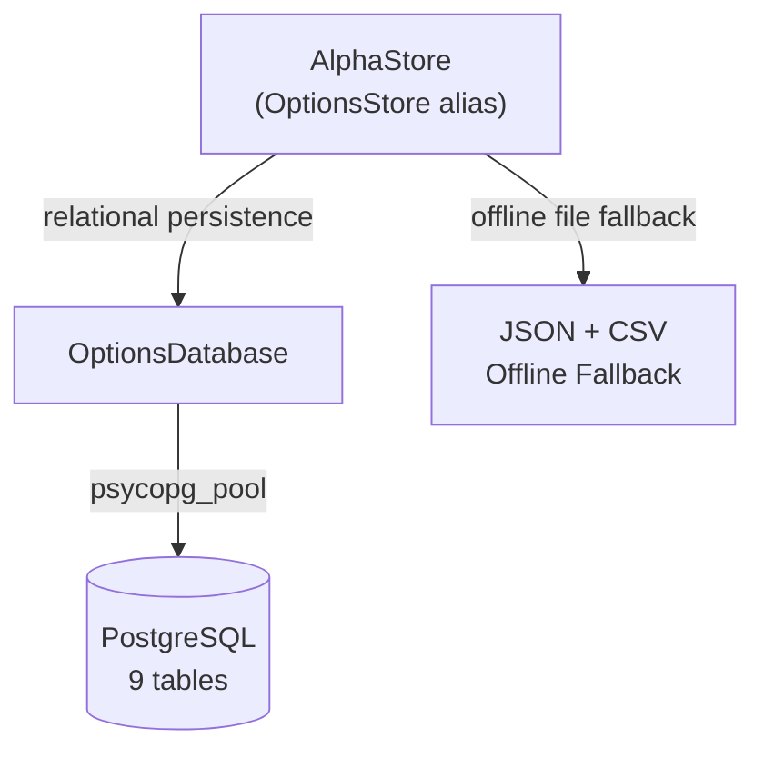

# Architecture — brain-store

## Architecture Overview

`OptionsDatabase` handles all SQL statements, transaction rollbacks, and connection pooling.
`AlphaStore` is the unified facade providing transparent fallback to local disk storage when `DATABASE_URL` is unavailable.
