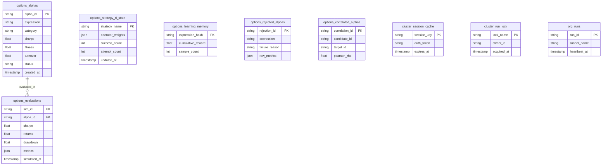

# Dual-Mode Relational Schema & Migration Guide

> Author: [Xtley001](https://github.com/Xtley001) · Package: `brain-store` · Version: `0.1.0`

`brain-store` delivers dual-mode persistence for quantitative alpha pipelines. It connects seamlessly to Neon PostgreSQL with connection pooling via `psycopg_pool`, while providing 100% offline fallback to local JSON/CSV file storage when `DATABASE_URL` is absent.

---

## 1. Relational Schema Architecture



---

## 2. Table Specifications

| Table | Purpose | Indexing Strategy |
|---|---|---|
| `options_alphas` | Qualified and submitted alpha reserve vault | Unique on `alpha_id`, Index on `status`, `category` |
| `options_evaluations` | Complete simulation backtest history log | Index on `alpha_id`, `simulated_at` |
| `options_strategy_rl_state` | Strategy-level reinforcement learning operator weights | Primary key on `strategy_name` |
| `options_learning_memory` | Global Multi-Armed Bandit expression reward tracking | Primary key on `expression_hash` |
| `options_rejected_alphas` | Diagnostics for checklist / gate-failed alphas | Index on `failure_reason` |
| `options_correlated_alphas` | Audit log of self-correlation gate rejections ($|\rho| \ge 0.70$) | Index on `candidate_id` |
| `cluster_session_cache` | Distributed BRAIN auth session token caching (2h TTL) | Primary key on `session_key` |
| `cluster_run_lock` | Distributed mutex preventing duplicate simulation runs | Primary key on `lock_name` |
| `org_runs` | Continuous heartbeat and worker telemetry monitoring | Primary key on `run_id` |

---

## 3. Dual-Mode Operation: Online vs File Fallback

The unified facade `AlphaStore` automatically checks connectivity via `is_available()`:

```python
from brain_store import AlphaStore

# Automatically detects DATABASE_URL; if unavailable, falls back to ./data/
store = AlphaStore(data_dir="./local_vault")

# Load past evaluated expressions with pagination
expressions = store.load_evaluated_expressions(limit=500, offset=0)
print(f"Loaded {len(expressions)} expressions")
```

---

## 4. Running Migrations

Database migrations are located in `brain_store/migrations/`:
- `001_initial_schema.sql`: Full DDL creating all 9 tables, indexes, and triggers.
- `002_add_hash_index.sql`: B-tree indexing on expression hashes.

To execute against your Neon PostgreSQL instance:

```bash
# Using psql:
psql $DATABASE_URL -f brain_libraries/brain_store/brain_store/migrations/001_initial_schema.sql

# Or programmatically via OptionsDatabase:
from brain_store import OptionsDatabase
db = OptionsDatabase()
db.run_migrations()
```
