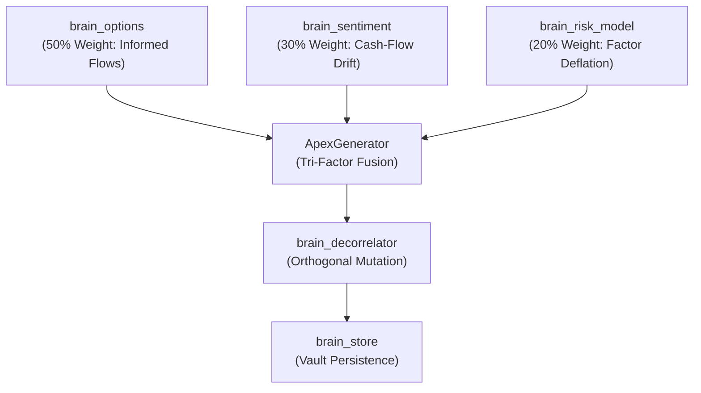

# Architecture — brain_synthesis

`brain_synthesis` fuses disparate domain signals into cross-asset multi-factor meta-alphas for WorldQuant BRAIN.

## Component Flow

## Golden Apex Production Formulations

| ID | Name | Architecture | Platform Role |
|---|---|---|---|
| `apex_golden_01` | Informed Downside × Revision Divergence | Smirk + Revision Delta - Residual Vol | Maximum Sharpe anchor |
| `apex_golden_02` | Forward Basis Cushion × PEAD Acceleration | Basis Cushion + SUE Drift - SPY Beta | Event earnings momentum |
| `apex_golden_03` | Term Premium Steepener × Consensus Breadth | IV Term Slope + Target Upgrades - Beta Accel | Regime transition alpha |
| `apex_golden_04` | Variance Risk Arbitrage × Revision Momentum | VRP Spread + EPS Momentum - Correlation | Mean-reversion premium |
| `apex_golden_05` | Downside Breakeven Safety × Quality Confluence | Put Safety Cushion + Forecast Dispersion - Vol | Long-horizon low-turnover |
